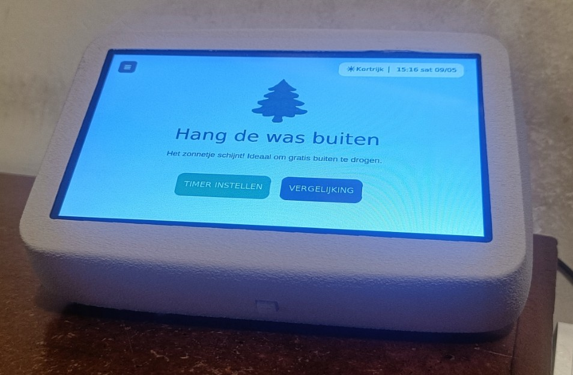
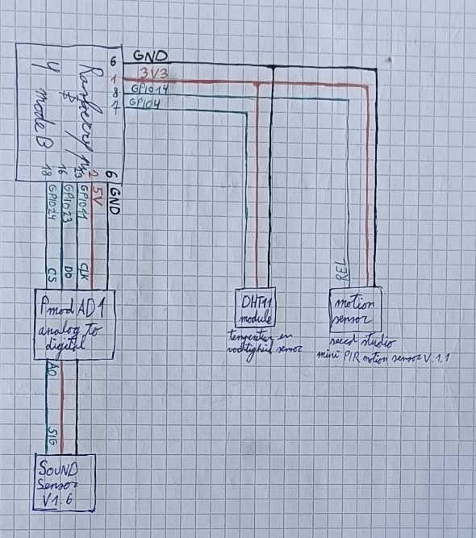

# 🌲 Drooghulp

Een slim dashboard op de Raspberry Pi dat je helpt beslissen **waar je het beste je was hangt om te drogen**: buiten, binnen of in de droogkast. De app combineert live weerdata, sensormetingen en energieprijzen om een aanbeveling te geven. Dit programeerproject is een deel van een groter project wat je [hier](https://github.com/djroose/De-Drooghulp.git) vinden



---

## Wat doet het?

- **Vergelijkt drie droogopties** (buiten / binnen / droogkast) op basis van:
  - Live buitentemperatuur en regenkans (via Open-Meteo API)
  - Binnentemperatuur en luchtvochtigheid (DHT22-sensor)
  - Actuele energieprijs (via Entsoe API)
- **Berekent de verwachte droogtijd** afhankelijk van het type was (licht / gemiddeld / zwaar)
- **Timerfunctie** per droogmethode met voortgangsbalk
- **Geluidssensor** (Grove Sound Sensor v1.6 via PmodAD1) en **bewegingssensor** voor automatisch scherm dimmen
- Werkt ook op een gewone pc/laptop in **testmodus** (zonder GPIO)

---

## Hardware

| Component | Aansluiting |
|---|---|
| DHT22 temperatuur/vochtsensor | BOARD pin 7 (BCM 4) |
| Grove Sound Sensor v1.6 (via PmodAD1) | CLK: BOARD 16, CS: BOARD 12, D0: BOARD 36 |
| PIR bewegingssensor | BOARD pin 8 (BCM 14) |
| 7-inch touchscreen | HDMI + USB |



---

## Mapstructuur

```
drooghulp/
├── TEST_LAYOUTS/        # Tussenversies van de UI (ontwikkelingshistorie)
│   ├── TEST2.py
│   ├── TEST_IMPORT.py
│   ├── TEST_IMPORT2.py
│   ├── Test_LAYOUT.py
│   ├── import3.py
│   └── import5.py 
├── .gitignore.md
├── README.md
├── hardware_test.py     # Losse hardware test (GPIO/sensoren)
├── main.py              # Hoofdapplicatie (eindversie)
├── motion_test.py       # Losse test voor de bewegingssensor
├── pyproject.toml
└── requirements.txt

```

---

## Installatie

### 1. Repository clonen
```bash
git https://github.com/JutteDeBaets/drooghulp
cd drooghulp
```

### 2. Virtuele omgeving aanmaken
```bash
python -m venv .venv
source .venv/bin/activate        # Linux / Raspberry Pi
# of: .venv\Scripts\activate     # Windows
```

### 3. Dependencies installeren
```bash
pip install -r requirements.txt
```

> Op een Raspberry Pi zijn extra stappen nodig voor GPIO:
> ```bash
> sudo apt install python3-rpi.gpio python3-libgpiod
> ```

---

## Opstarten

```bash
python main.py
```

Op een gewone pc start de app automatisch in **testmodus** — alle sensorwaarden worden gesimuleerd en de volledige UI is gewoon te gebruiken.

---

## Dependencies

| Package | Waarvoor |
|---|---|
| `customtkinter` | Moderne GUI |
| `Pillow` | Afbeeldingen laden |
| `adafruit-circuitpython-dht` | DHT22/DHT11 sensor uitlezen |
| `adafruit-blinka` | CircuitPython op de Pi |
| `gpiozero` | GPIO bewegingssensor |
| `RPi.GPIO` | SPI bit-bang voor geluidssensor |
| `requests` | Energieprijzen API |

---

## Ontwikkeld door

Project gemaakt in het kader van Opkomende Technologieën, opleiding Industrieel Ingenieur: Industrieel Ontwerpen aan de UGent.
Hardware-integratie: Jutte De Baets. UI & logica: Djurre Roose.
